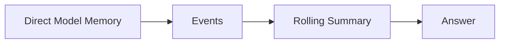
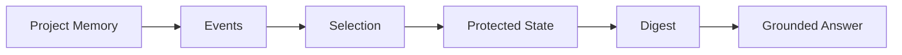
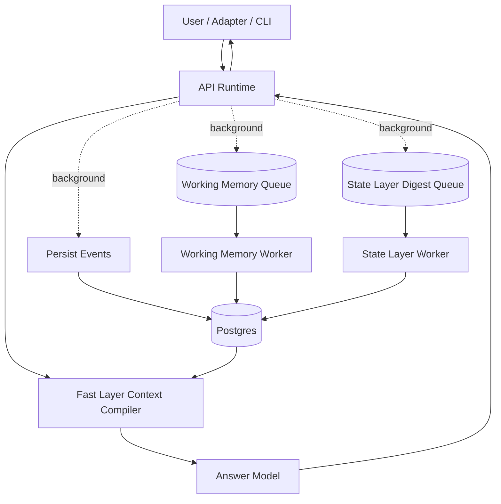

# Project Memory

[](https://github.com/yul761/ProjectMemory/actions/workflows/ci.yml)
[](https://github.com/yul761/ProjectMemory/actions/workflows/integration-smoke.yml)
[](https://opensource.org/licenses/MIT)
[](https://github.com/yul761/ProjectMemory/releases)

LLM memory systems don't fail because of prompts.
They fail because memory is treated as uncontrolled text.

If memory matters, it must be treated as state — not context.

Project Memory is a self-hosted memory control layer for AI systems.

It turns memory from accumulated text into controlled state:

- replayable state instead of opaque history
- a digest control pipeline instead of a single summary refresh
- explicit Fast Layer / Working Memory / State Layer separation
- grounded recall and answers instead of blind retrieval

It is not a chatbot or a prompt wrapper.
It is infrastructure for memory continuity.

## Start Here

Choose the fastest path for what you want:

- Try the public demo: `http://147.182.174.191`
- Try the interactive demo: `docs/demo-quickstart.md`
- Deploy the demo stack: `deploy.md`
- Fastest proof: `artifacts/demos/visible-comparison-latest.md`
- Quick orientation: `docs/start-here.md`
- Product API boundary: `docs/product-surface.md`
- Demo app surface: `docs/demo-web-surface.md`
- Repo structure: `docs/repo-map.md`
- Implementation details: `docs/technical-overview.md`
- Evaluation model: `docs/drift-definition.md`

There is now also a minimal demo shell in `apps/demo-web` that stays on the
intended public runtime surface.

Fastest local interactive path:

```bash
pnpm dev:demo-stack
```

Then open:

- `http://localhost:3100`

That launcher waits until the API and demo shell are reachable before it
prints `Demo stack ready.`

If you want the fuller local setup path instead of just the final command, use:

- `docs/demo-quickstart.md`

## Try The Demo

The interactive demo is the fastest way to understand the product shape.

Public demo:

- `http://147.182.174.191`

What you will see:

- a scope browser for long-running sessions
- a chat UI backed by `POST /memory/runtime/turn`
- a hero card showing current goal, versions, and layer health
- a turn story showing how Fast Layer, Working Memory, and State Layer handled the turn
- an inspector for Working Memory, Stable State, Fast View, and layer diagnostics

Best first questions in the demo:

- `What is the current goal?`
- `What constraints still apply?`
- `What key decisions have we made?`
- `What work remains open?`

What to watch while those run:

- the hero card for current scope state
- the turn story for the high-level narrative
- the turn pipeline for Fast / Working / State progress
- the inspector summaries for the actual layer snapshots

If you want the exact setup and first-minute walkthrough, use:

- `docs/demo-quickstart.md`

## Observable Evidence

If you want one concrete result before reading the architecture, start with the curated demo:

- `artifacts/demos/visible-comparison-latest.md`
- `artifacts/demos/visible-comparison-latest.json`
- `docs/observable-comparison.md`

That sample evaluates the same event stream in two ways:

- Project Memory
- a direct-model rolling-summary baseline

Current curated sample result:

- rounds evaluated: `3`
- questions evaluated: `7`
- Project Memory: `7/7`
- direct baseline: `4/7`

Most visible failure in the baseline:

- it compresses the final goal into `self-hosted memory runtime for local models`
- it drops `long-term`
- Project Memory preserves the full goal state

## At A Glance

The fastest way to understand the difference is this:





Project Memory is not trying to make one summary prompt slightly better.
It changes the memory update mechanism itself.

## Three-Layer Architecture

Project Memory now separates memory into three layers on purpose:

- Fast Layer
  - synchronous
  - used to assemble prompt context for the current turn
  - optimized for low latency, not for authority
- Working Memory Layer
  - lightweight, quickly updated structured memory
  - bridges the gap between raw recent turns and slow stable-state consolidation
  - session/task scoped and allowed to be approximate
- State Layer
  - authoritative, replayable, low-drift long-term memory
  - updated asynchronously through the controlled digest pipeline
  - source of durable truth

Why this split exists:

- a single layer is too slow if you want strict consolidation on every turn
- a single layer is too unreliable if you let fast-turn prompts become durable truth
- fast response and low-drift long-term memory are different jobs and should not share the same update path

## Current Status

The current repository state is beyond architecture sketches.
The three-layer runtime is implemented, benchmarked, and inspectable.

Latest three-layer quick benchmark:

- Fast path: `15.52 ms`
- Working Memory update: `532 ms`
- State Layer update: `4132 ms`
- direct-state fast-path rate: `1`
- runtime vs layer-status consistency: `1`
- Working Memory caught-up rate: `1`
- Stable State caught-up rate: `1`
- Long-term Memory Reliability: `84.2`
- Replay state match: `yes`

Latest observable drift checks:

- Visible comparison: Project Memory `7/7`, direct baseline `4/7`
- Goal-evolution drift run: goal / constraint / decision / todo drift `0`
- Goal-evolution digest drift: `0`
- Goal-evolution runs succeeded: `10/10`
- Failure-mode mixed-signals drift run: goal / constraint / decision / todo drift `0`
- Runtime readiness check: doctor + benchmark + drift all pass in one CI-style run

What this means in practice:

- Fast Layer now has a direct state fast path for canonical state questions
- Working Memory updates independently in the background
- State Layer remains asynchronous and authoritative
- API responses expose layer versions, retrieval plan, and answer mode for debugging

What is still being hardened:

- broader benchmark fixtures beyond the current long-session and mixed-signal additions
- more hosted-CI repetition for the visible comparison and runtime readiness paths
- release-style runtime readiness automation on hosted CI

Useful inspection endpoints:

- `GET /memory/working-state`
- `GET /memory/stable-state`
- `GET /memory/fast-view`
- `GET /memory/layer-status`
- `POST /memory/runtime/turn`

Recommended demo-facing API boundary:

- public runtime surface: `POST /memory/runtime/turn`, `GET /memory/working-state`,
  `GET /memory/stable-state`, `GET /memory/fast-view`, `GET /memory/layer-status`,
  plus scope/session endpoints
- debug surface: raw retrieval, raw answer, raw event/digest inspection
- internal control surface: manual event ingestion and digest/rebuild operations

See `docs/product-surface.md` for the intended split and `docs/repo-map.md` for
where product runtime code ends and benchmark/tooling code begins.

The local runtime smoke now validates the full three-layer product path:

- ingest baseline events
- enqueue a State Layer digest
- inspect Working Memory
- inspect Stable State
- inspect Fast Layer context and aggregated layer status
- probe a runtime turn and verify `answerMode` / `retrievalPlan` / `layerAlignment`
- verify `freshness.workingMemoryCaughtUp` / `freshness.stableStateCaughtUp`
- fail if aggregated diagnostics emit warnings on the clean smoke scope

There is now also a heavier readiness path for CI or release checks:

- `pnpm ci:runtime-readiness`
- runs runtime smoke
- runs a quick three-layer benchmark
- runs a goal-evolution drift benchmark
- writes `runtime-readiness-summary.json` and `runtime-readiness-summary.md`
- fails if runtime freshness, runtime diagnostics, or drift regress

## Turn Lifecycle

1. User message hits the runtime entrypoint.
2. Fast Layer builds prompt context from recent turns, retrieval, Working Memory, and State Layer snapshots.
3. The model returns an immediate response.
4. The API returns that response immediately.
5. In the background, the system persists events, updates Working Memory, and optionally enqueues a State Layer digest.
6. The next turn sees the newer Working Memory immediately, and the newer State Layer once the digest commits.

## What Problem It Solves

Most LLM applications accumulate memory in one of two ways:

- append more text to context
- store text in retrieval systems and hope similarity search brings back the right facts

That breaks down over time:

- goals drift
- constraints get dropped
- decisions get overwritten
- todos turn into noisy summaries
- memory state becomes hard to replay or debug

Project Memory solves that by treating memory as state transitions with explicit control over how information is selected, consolidated, checked, and committed.

## Why Not RAG Memory?

Most "memory" systems today:

- store text in a vector database
- retrieve by similarity
- append summaries over time

That helps recall, but it does not solve:

- drift
- contradictions
- unstable long-term state
- non-replayable memory evolution

Project Memory instead:

- models memory as protected state
- uses a controlled digest pipeline
- enforces consistency before commit
- supports replay and rebuild

## Key Concepts

- Replayable state
  - the same history can be rebuilt into the same protected state and transition taxonomy
- Digest control pipeline
  - memory is consolidated through selection, merge, validation, and retry rather than one free-form LLM response
- Consistency gate
  - proposed digests are checked for contradictions, omissions, repeated changes, and low-signal outputs before acceptance
- Grounded recall
  - answers and runtime turns return evidence from digests, events, and protected state

## Comparison

|                       | Traditional RAG Memory | Project Memory    |
| --------------------- | ---------------------- | ----------------- |
| Model                 | Text accumulation      | State transitions |
| Drift control         | ❌                     | ✅                |
| Replayable            | ❌                     | ✅                |
| Deterministic updates | ❌                     | Partial           |
| Trustable over time   | ❌                     | Designed for it   |

## Example

Command:

```bash
pnpm dev:cli -- turn "goal: ship a memory engine"
```

Output:

- summary: project goal defined and stored in protected state
- next steps: define architecture, implement digest pipeline, add consistency checks

## Quickstart

1. Start infra

```bash
docker-compose up -d
```

2. Install deps

```bash
pnpm install
```

3. Set env

```bash
cp .env.example .env
```

4. Prepare the database

```bash
pnpm db:generate
pnpm db:migrate
pnpm seed
```

5. Run the services

```bash
pnpm dev:api
pnpm dev:worker
```

Optional:

```bash
pnpm dev:cli -- state
pnpm dev:cli -- working-state
pnpm dev:cli -- stable-state
pnpm dev:cli -- layer-status
pnpm dev:cli -- doctor
pnpm dev:cli -- doctor --probe-turn
pnpm dev:cli -- doctor --probe-turn --assert-clean
pnpm dev:cli -- fast-view "What is the current goal?"
pnpm dev:cli -- turn "What changed in the project plan?"
pnpm smoke:runtime
pnpm benchmark:visible
```

`pm doctor` now also reports `layerAlignment`, so you can see whether Working
Memory and Stable State agree on the current goal and how much constraint /
decision overlap exists before you inspect the raw snapshots. It also reports
`layerFreshness`, so you can see whether those layers are actually caught up to
the latest ingested event stream.

If you want a pass/fail diagnostic instead of just JSON output, use:

```bash
pnpm dev:cli -- doctor --probe-turn --assert-clean
```

For automation, you can pin the CLI to a stable identity:

```bash
PROJECT_MEMORY_CLI_USER_ID=runtime-ci-user pnpm dev:cli -- doctor --probe-turn --assert-clean
```

If you want a machine-readable diagnosis artifact:

```bash
PROJECT_MEMORY_CLI_USER_ID=runtime-ci-user pnpm dev:cli -- doctor --probe-turn --assert-clean --output-file runtime-doctor.json
```

When you run `pnpm dev:cli` from the repo root, relative `--output-file` paths now
resolve from that invocation directory, so `runtime-doctor.json` is written to the
repo root instead of `apps/cli/`.

For a fuller local verification pass:

```bash
pnpm smoke
```

That now includes:

- no-LLM smoke
- LLM answer smoke
- runtime smoke
- reminders smoke

## Why This Exists

Memory drift is inevitable when memory is treated as text.

Prompt engineering can improve formatting, but it cannot make long-term memory stable on its own.
If memory matters, it has to be treated as state:

- selected deliberately
- merged conservatively
- validated before commit
- rebuildable from history

That is the core bet behind Project Memory.

## Design Philosophy

- The LLM is not the source of truth
  - it proposes digests and answers, but the system owns state
- The system enforces correctness
  - consistency checks, retries, and protected merges exist to constrain drift
- Memory must be rebuildable
  - replay and rebuild are first-class so memory can be audited instead of trusted blindly

## Config Matrix

Required for all:

- `DATABASE_URL`
- `REDIS_URL`

API (`apps/api`):

- `PORT`
- `LOCAL_USER_TOKEN`
- optional LLM config with `FEATURE_LLM=true` and `MODEL_*`

Worker (`apps/worker`):

- `FEATURE_LLM=true` and `MODEL_*`
- digest tuning with `DIGEST_*`
- optional reminder delivery with `FEATURE_TELEGRAM=true` and `TELEGRAM_BOT_TOKEN`

CLI (`apps/cli`):

- `API_BASE_URL`

## Model Setup

Set `FEATURE_LLM=true` and configure:

- `MODEL_PROVIDER`
- `MODEL_BASE_URL`
- `MODEL_NAME`
- `MODEL_API_KEY`

Optional role-specific overrides:

- `MODEL_CHAT_*`
- `MODEL_STRUCTURED_OUTPUT_*`
- `MODEL_EMBEDDING_*`

Useful for slower local or hosted backends:

- `MODEL_TIMEOUT_MS`

Legacy `OPENAI_*` variables are still accepted.

Optional hybrid retrieval can be enabled with:

- `RETRIEVE_USE_EMBEDDINGS=true`

## Architecture

Project Memory sits between your interaction layer and your model endpoint.
It owns the fast-turn context path, Working Memory updates, State Layer consolidation, replay, and grounded answer generation.



Core responsibilities:

- build fast-turn prompt context without waiting for full stable-state consolidation
- maintain low-latency Working Memory snapshots for active conversations
- consolidate authoritative State Layer snapshots through the digest control pipeline
- retrieve grounded evidence for runtime turns and answer calls
- run replay and rebuild workflows for stable-state validation

## Benchmarking

Project Memory includes built-in evaluation for:

- ingest and retrieval performance
- fast-turn latency
- working-memory update latency
- State Layer digest consistency and repeatability
- replay consistency and transition matching
- grounded answer coverage
- long-term memory reliability
- drift and ablation runs

Run:

```bash
pnpm benchmark
```

Three-layer runtime scenario:

```bash
BENCH_FIXTURE=benchmark-fixtures/three-layer-session.json pnpm benchmark
```

More detail lives in:

- `docs/benchmarking.md`
- `artifacts/releases/v1.0.0/`

Local benchmark outputs are written to `benchmark-results/`.
That working directory is ignored from git.
Curated release snapshots are archived under `artifacts/releases/`.
Curated demo evidence for repo visitors lives under `artifacts/demos/`.

## Docs

- Start here: `docs/start-here.md`
- Vision and roadmap: `docs/vision-and-roadmap.md`
- Drift definition: `docs/drift-definition.md`
- Digest state specification: `docs/digest-state.md`
- Assistant runtime specification: `docs/assistant-runtime.md`
- Evaluation metrics specification: `docs/evaluation-metrics.md`
- Provider abstraction specification: `docs/provider-abstraction.md`
- Benchmark methodology: `docs/benchmarking.md`
- API reference: `docs/api.md`
- Release notes: `docs/release-v1.0.0.md`
- Release summary: `docs/release-v1.0.0-summary.md`

## Troubleshooting

- Prisma runs from `packages/db`, so copy `.env` to `packages/db/.env` before `pnpm db:migrate`
- If API or worker says `FEATURE_LLM disabled` but `.env` is set, restart the process
- Ensure Postgres port mapping matches `DATABASE_URL`
- Digest and rebuild endpoints require `FEATURE_LLM=true`

## Repo Structure

- `apps/api` NestJS REST API
- `apps/worker` BullMQ workers
- `apps/adapter-telegram` Telegram reference adapter
- `apps/cli` developer CLI
- `packages/core` memory engine logic
- `packages/contracts` shared schemas and enums
- `packages/prompts` prompt templates
- `packages/db` Prisma schema and client

Runtime entrypoint:

- `POST /memory/runtime/turn`

See `docs/technical-overview.md` for architecture internals.
See `docs/release.md` for release workflow.
