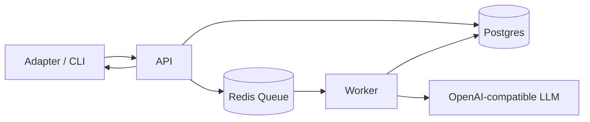

# Project Memory

[](https://github.com/yul761/ProjectMemory/actions/workflows/ci.yml)
[](https://github.com/yul761/ProjectMemory/actions/workflows/integration-smoke.yml)
[](https://opensource.org/licenses/MIT)
[](https://github.com/yul761/ProjectMemory/releases)

LLM memory systems don't fail because of prompts.
They fail because memory is treated as uncontrolled text.

Project Memory is a self-hosted control layer for long-term memory in AI systems.

It treats memory as controlled state instead of accumulated context:
- replayable state instead of opaque history
- a digest control pipeline instead of a single LLM call
- consistency gates and retry before commit
- grounded recall and answers instead of blind retrieval

This is not a chatbot.
This is not a RAG wrapper.
This is not a prompt tool.

It is a low-drift, replayable memory system for developers building AI assistants with local models or BYOM endpoints.

## What Problem It Solves

Most LLM applications accumulate memory in one of two ways:
- append more text to context
- store text in retrieval systems and hope similarity search brings back the right facts

That breaks down over time:
- goals drift
- constraints get dropped
- decisions get overwritten
- todos turn into noisy summaries
- memory state becomes hard to replay or debug

Project Memory solves that by treating memory as state transitions with explicit control over how information is selected, consolidated, checked, and committed.

## Why Not RAG Memory?

Most "memory" systems today:
- store text in a vector database
- retrieve by similarity
- append summaries over time

That helps recall, but it does not solve:
- drift
- contradictions
- unstable long-term state
- non-replayable memory evolution

Project Memory instead:
- models memory as protected state
- uses a controlled digest pipeline
- enforces consistency before commit
- supports replay and rebuild

## Key Concepts

- Replayable state
  - the same history can be rebuilt into the same protected state and transition taxonomy
- Digest control pipeline
  - memory is consolidated through selection, merge, validation, and retry rather than one free-form LLM response
- Consistency gate
  - proposed digests are checked for contradictions, omissions, repeated changes, and low-signal outputs before acceptance
- Grounded recall
  - answers and runtime turns return evidence from digests, events, and protected state

## Comparison

|                       | Traditional RAG Memory | Project Memory     |
| --------------------- | ---------------------- | ----------------- |
| Model                 | Text accumulation      | State transitions |
| Drift control         | ❌                     | ✅                |
| Replayable            | ❌                     | ✅                |
| Deterministic updates | ❌                     | Partial           |

## Example

Command:

```bash
pnpm dev:cli -- turn "goal: ship a memory engine"
```

Output:
- summary: project goal defined and stored in protected state
- next steps: define architecture, implement digest pipeline, add consistency checks

## Quickstart

1. Start infra

```bash
docker-compose up -d
```

2. Install deps

```bash
pnpm install
```

3. Set env

```bash
cp .env.example .env
```

4. Prepare the database

```bash
pnpm db:generate
pnpm db:migrate
pnpm seed
```

5. Run the services

```bash
pnpm dev:api
pnpm dev:worker
```

Optional:

```bash
pnpm dev:cli -- state
pnpm dev:cli -- turn "What changed in the project plan?"
```

## Why This Exists

Memory drift is inevitable when memory is treated as text.

Prompt engineering can improve formatting, but it cannot make long-term memory stable on its own.
If memory matters, it has to be treated as state:
- selected deliberately
- merged conservatively
- validated before commit
- rebuildable from history

That is the core bet behind Project Memory.

## Design Philosophy

- The LLM is not the source of truth
  - it proposes digests and answers, but the system owns state
- The system enforces correctness
  - consistency checks, retries, and protected merges exist to constrain drift
- Memory must be rebuildable
  - replay and rebuild are first-class so memory can be audited instead of trusted blindly

## Config Matrix

Required for all:
- `DATABASE_URL`
- `REDIS_URL`

API (`apps/api`):
- `PORT`
- `LOCAL_USER_TOKEN`
- optional LLM config with `FEATURE_LLM=true` and `MODEL_*`

Worker (`apps/worker`):
- `FEATURE_LLM=true` and `MODEL_*`
- digest tuning with `DIGEST_*`
- optional reminder delivery with `FEATURE_TELEGRAM=true` and `TELEGRAM_BOT_TOKEN`

CLI (`apps/cli`):
- `API_BASE_URL`

## Model Setup

Set `FEATURE_LLM=true` and configure:
- `MODEL_PROVIDER`
- `MODEL_BASE_URL`
- `MODEL_NAME`
- `MODEL_API_KEY`

Optional role-specific overrides:
- `MODEL_CHAT_*`
- `MODEL_STRUCTURED_OUTPUT_*`
- `MODEL_EMBEDDING_*`

Useful for slower local or hosted backends:
- `MODEL_TIMEOUT_MS`

Legacy `OPENAI_*` variables are still accepted.

Optional hybrid retrieval can be enabled with:
- `RETRIEVE_USE_EMBEDDINGS=true`

## Architecture

Project Memory sits between your interaction layer and your model endpoint.
It owns memory state, digest control, replay, and grounded answer generation.



Core responsibilities:
- ingest events and document updates
- maintain protected memory state
- consolidate memory through digest control
- retrieve grounded evidence
- run replay and rebuild workflows

## Benchmarking

Project Memory includes built-in evaluation for:
- ingest and retrieval performance
- digest consistency and repeatability
- replay consistency and transition matching
- grounded answer coverage
- long-term memory reliability
- drift and ablation runs

Run:

```bash
pnpm benchmark
```

More detail lives in:
- `docs/benchmarking.md`
- `artifacts/releases/v1.0.0/`

Local benchmark outputs are written to `benchmark-results/`.
That working directory is ignored from git.
Curated release snapshots are archived under `artifacts/releases/`.

## Docs

- Vision and roadmap: `docs/vision-and-roadmap.md`
- Drift definition: `docs/drift-definition.md`
- Digest state specification: `docs/digest-state.md`
- Assistant runtime specification: `docs/assistant-runtime.md`
- Evaluation metrics specification: `docs/evaluation-metrics.md`
- Provider abstraction specification: `docs/provider-abstraction.md`
- Benchmark methodology: `docs/benchmarking.md`
- API reference: `docs/api.md`
- Release notes: `docs/release-v1.0.0.md`
- Release summary: `docs/release-v1.0.0-summary.md`

## Troubleshooting

- Prisma runs from `packages/db`, so copy `.env` to `packages/db/.env` before `pnpm db:migrate`
- If API or worker says `FEATURE_LLM disabled` but `.env` is set, restart the process
- Ensure Postgres port mapping matches `DATABASE_URL`
- Digest and rebuild endpoints require `FEATURE_LLM=true`

## Repo Structure

- `apps/api` NestJS REST API
- `apps/worker` BullMQ workers
- `apps/adapter-telegram` Telegram reference adapter
- `apps/cli` developer CLI
- `packages/core` memory engine logic
- `packages/contracts` shared schemas and enums
- `packages/prompts` prompt templates
- `packages/db` Prisma schema and client

Runtime entrypoint:
- `POST /memory/runtime/turn`

See `docs/technical-overview.md` for architecture internals.
See `docs/release.md` for release workflow.
